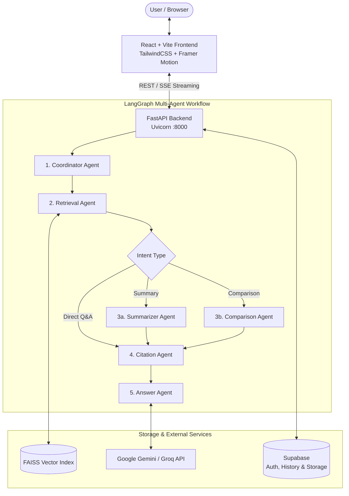

# 🏢 Enterprise AI Assistant

> **A Production-Grade, Multi-Agent Knowledge Retrieval (RAG) Platform** powered by **FastAPI**, **LangGraph**, **Google Gemini**, **FAISS**, and **React + Vite**.

---

## 🌟 Overview

**Enterprise AI Assistant** is an enterprise knowledge management and intelligent Q&A platform. It enables teams to upload internal documents (PDFs, Word documents, PowerPoint presentations, text files) and query them through a specialized **multi-agent workflow**. 

Rather than relying on a single prompt, the system routes queries through specialized LangGraph agents that handle query analysis, semantic retrieval, cross-document comparison, verification, citation extraction, and grounded answer synthesis with page-level PDF citations.

---

## 🚀 Key Features

### 🤖 Multi-Agent Orchestration (LangGraph)
- **Coordinator Agent**: Evaluates user intent, determines query complexity, and plans the retrieval strategy.
- **Retrieval Agent**: Conducts semantic vector search over FAISS vector stores to fetch the most relevant context chunks.
- **Summarizer Agent**: Condenses lengthy document sections into focused summaries without losing crucial context.
- **Comparison Agent**: Detects cross-document contradictions, differences, and chronological changes across multiple files.
- **Citation Agent**: Verifies facts against source chunks and computes precise citations (document name, page number, confidence score).
- **Answer Agent**: Generates accurate, well-formatted Markdown responses grounded strictly in retrieved context.

### 📄 Intelligent Document Processing & RAG
- **Multi-Format Parsing**: Full support for `.pdf`, `.docx`, `.pptx`, and `.txt` files.
- **Semantic Chunking**: Configurable sliding-window chunking with token overlap and sentence boundary preservation.
- **Vector Search**: Local vector embeddings powered by `BAAI/bge-small-en-v1.5` and persisted via **FAISS**.
- **Interactive PDF Citation Viewer**: Inspect source documents directly in the UI with highlighted text layers and jump-to-page navigation.

### 🎨 Modern, High-Performance Frontend
- **Dark / Light Mode**: Integrated system theme detection and manual theme switcher.
- **Real-Time Agent Execution Trace**: Transparent view into agent thought processes, routing decisions, and retrieved chunks.
- **Document Management**: File upload with real-time chunking metrics, category tagging, search, and deletion.
- **Conversations & History**: Persist chat sessions, search previous conversations, and export discussions.
- **Secure Authentication**: Built-in authentication powered by Supabase (Email/Password & Google OAuth).

---

## 🏗️ Architecture



---

## 🛠️ Tech Stack

| Layer | Technologies |
| :--- | :--- |
| **Frontend** | React 18, Vite, TailwindCSS, Lucide Icons, Framer Motion |
| **Backend** | Python 3.10+, FastAPI, Uvicorn, Pydantic v2 |
| **Agent Framework** | LangGraph, LangChain Core |
| **LLM Provider** | Google Gemini (`gemini-2.5-flash`), Groq (`llama-3.3-70b-versatile`) |
| **Vector Store & Embeddings** | FAISS (Facebook AI Similarity Search), FastEmbed (`BAAI/bge-small-en-v1.5`) |
| **Database & Auth** | Supabase (PostgreSQL, Row Level Security, Auth, Storage) |

---

## 📁 Project Structure

```
Enterprise_AI_Assisstant/
├── start.bat                  # One-click launcher for Windows (Backend + Frontend)
├── pyrightconfig.json         # Python language server configuration
├── README.md                  # Project documentation
│
├── backend/                   # FastAPI Python Application
│   ├── main.py                # Server entry point & router registration
│   ├── requirements.txt       # Python dependencies
│   ├── .env.example           # Environment template
│   ├── .env                   # Active environment secrets (git-ignored)
│   ├── agents/                # LangGraph specialized agent nodes
│   │   ├── coordinator.py     # Intent classification & pipeline routing
│   │   ├── retrieval.py       # Semantic vector retrieval
│   │   ├── summarizer.py      # Document summarization
│   │   ├── comparison.py      # Cross-document analysis
│   │   ├── citation.py        # Citation extraction & verification
│   │   └── answer.py          # Final grounded response generator
│   ├── api/                   # REST API route handlers
│   │   ├── chat.py            # Chat & streaming endpoints
│   │   ├── documents.py       # Upload & document management
│   │   ├── processing.py      # Text extraction & chunking
│   │   ├── rag.py             # Vector search & FAISS endpoints
│   │   ├── agent.py           # Multi-agent execution & graph health
│   │   └── notifications.py   # User notifications
│   ├── database/              # Supabase client & repositories
│   ├── graph/                 # LangGraph state definition & workflow graph
│   ├── models/                # Pydantic request & response schemas
│   ├── processing/            # Loaders (PDF, DOCX, TXT), chunker, embedder, FAISS store
│   └── services/              # LLM service, prompt builder, email service
│
└── frontend/                  # React + Vite Single Page Application
    ├── package.json           # Node.js dependencies
    ├── vite.config.js         # Vite configuration & proxy settings
    ├── tailwind.config.js     # Tailwind CSS theme configuration
    ├── index.html             # HTML entry point
    ├── .env.example           # Frontend environment template
    ├── .env                   # Frontend environment secrets (git-ignored)
    └── src/
        ├── App.jsx            # Main app component & routes
        ├── components/        # Reusable UI & document viewer components
        │   ├── documents/     # Upload, Category filter, PDF Citation Viewer
        │   ├── layout/        # Navbar, Sidebar, AppLayout
        │   └── ui/            # Buttons, Cards, Modals, Badges, Spinners, Toasts
        ├── context/           # AuthContext, ThemeContext, SidebarContext
        ├── pages/             # Auth, Chat, Dashboard, Documents, History, Settings, Profile
        ├── router/            # AppRouter & Protected Route Guards
        └── services/          # API client services (chat, document, notification)
```

---

## ⚙️ Getting Started

### Prerequisites
- **Python 3.10+** installed
- **Node.js 18+** & **npm** installed
- A **Google Gemini API Key** (or Groq API Key)
- A **Supabase** project (URL and API keys)

---

### 1. Backend Setup

1. Open your terminal and navigate to the `backend/` directory:
   ```bash
   cd backend
   ```

2. (Recommended) Create and activate a Python virtual environment:
   ```bash
   # Windows
   python -m venv venv
   .\venv\Scripts\activate

   # macOS / Linux
   python3 -m venv venv
   source venv/bin/activate
   ```

3. Install required Python packages:
   ```bash
   pip install -r requirements.txt
   ```

4. Configure your environment variables:
   ```bash
   cp .env.example .env
   ```
   Open `backend/.env` and update the following settings:
   ```ini
   LLM_PROVIDER=gemini
   GEMINI_API_KEY=your_gemini_api_key_here
   LLM_MODEL=gemini-2.5-flash

   SUPABASE_URL=https://your-project.supabase.co
   SUPABASE_SERVICE_ROLE_KEY=your_supabase_service_role_key
   SUPABASE_BUCKET=enterprise-documents
   ```

5. Start the FastAPI server:
   ```bash
   python -m uvicorn main:app --reload --port 8000
   ```
   The backend API will run at **http://127.0.0.1:8000**. Interactive API documentation is available at **http://127.0.0.1:8000/docs**.

---

### 2. Frontend Setup

1. Open a new terminal and navigate to the `frontend/` directory:
   ```bash
   cd frontend
   ```

2. Install dependencies:
   ```bash
   npm install
   ```

3. Configure your frontend environment:
   ```bash
   cp .env.example .env
   ```
   Ensure `frontend/.env` contains:
   ```ini
   VITE_API_URL=http://127.0.0.1:8000
   VITE_API_BASE_URL=http://127.0.0.1:8000/api
   VITE_SUPABASE_URL=https://your-project.supabase.co
   VITE_SUPABASE_ANON_KEY=your_supabase_anon_key
   ```

4. Start the Vite development server:
   ```bash
   npm run dev
   ```
   Open your browser and navigate to **http://localhost:5173**.

---

### 3. Quick Launch (Windows)

If you are on Windows, you can start both the backend and frontend simultaneously by double-clicking:
```bat
start.bat
```
or running `./start.bat` from PowerShell / Command Prompt.

---

## 🔑 Environment Variables Reference

### Backend (`backend/.env`)

| Variable | Default | Description |
| :--- | :--- | :--- |
| `PORT` | `8000` | Port for FastAPI uvicorn server |
| `LLM_PROVIDER` | `gemini` | Primary LLM provider (`gemini` or `groq`) |
| `GEMINI_API_KEY` | `""` | Google Gemini API key |
| `GROQ_API_KEY` | `""` | Groq Cloud API key (optional fallback) |
| `LLM_MODEL` | `gemini-2.5-flash` | Model identifier |
| `LLM_TEMPERATURE` | `0.7` | Temperature for response creativity |
| `SUPABASE_URL` | `""` | Supabase project URL |
| `SUPABASE_SERVICE_ROLE_KEY` | `""` | Supabase Service Role key (backend access) |
| `SUPABASE_BUCKET` | `enterprise-documents` | Supabase Storage bucket for uploaded files |
| `EMBEDDING_MODEL` | `BAAI/bge-small-en-v1.5` | FastEmbed sentence embedding model |
| `EMBEDDING_DIMENSION` | `384` | Embedding vector dimension |
| `FAISS_INDEX_PATH` | `faiss_index` | Directory for FAISS index persistence |
| `CHUNK_SIZE` | `800` | Characters per document chunk |
| `CHUNK_OVERLAP` | `150` | Character overlap between consecutive chunks |
| `RAG_TOP_K` | `5` | Maximum chunks retrieved per query |

### Frontend (`frontend/.env`)

| Variable | Default | Description |
| :--- | :--- | :--- |
| `VITE_API_URL` | `http://127.0.0.1:8000` | Base backend server URL |
| `VITE_API_BASE_URL` | `http://127.0.0.1:8000/api` | API prefix URL |
| `VITE_SUPABASE_URL` | — | Supabase project URL for authentication |
| `VITE_SUPABASE_ANON_KEY` | — | Supabase Anonymous public key |

---

## 📡 Key API Endpoints

| Method | Endpoint | Description |
| :--- | :--- | :--- |
| `GET` | `/health` | Server health and vector store status |
| `POST` | `/api/documents/upload` | Upload and process files (PDF, DOCX, PPTX, TXT) |
| `GET` | `/api/documents` | List uploaded documents with metadata |
| `DELETE` | `/api/documents/{id}` | Delete a document and its embeddings |
| `POST` | `/api/agent/run` | Execute the full LangGraph multi-agent pipeline |
| `POST` | `/api/chat/stream` | Stream chat response with agent trace via SSE |
| `GET` | `/api/conversations` | Retrieve user conversation history |
| `GET` | `/docs` | Swagger interactive API documentation |

---

## 🔒 Security Best Practices

- **Never commit `.env` files**: Secrets and service role keys are excluded in `.gitignore`.
- **Row Level Security (RLS)**: Protect Supabase tables so users can only access their own documents and conversations.
- **Service Role Isolation**: Only the backend has access to `SUPABASE_SERVICE_ROLE_KEY`; the frontend only uses the public `ANON_KEY`.

---

## 📄 License

This project is licensed under the MIT License. See the LICENSE file for details.
